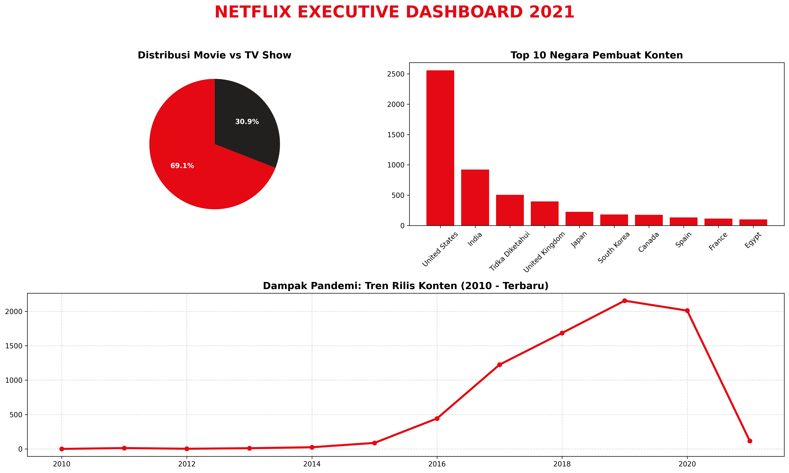

# Netflix Content Strategy Analysis 

Proyek ini adalah portofolio Data Analysis pertama saya yang berfokus pada eksplorasi tren konten Netflix menggunakan Python.

#Tujuan Proyek (Problem)
Menganalisis komposisi konten Netflix untuk mencari tahu kategori dominan, negara penyumbang terbanyak, dan dampak pandemi terhadap produksi film, guna memberikan rekomendasi strategi konten ke depan.

#Alat yang Digunakan (Method)
* **Bahasa:** Python
* **Library:** Pandas (Pembersihan Data) & Matplotlib (Visualisasi)
* **Environment:** Jupyter Notebook / VS Code

#Hasil Temuan Utama (Hasil)
1. **Dominasi Movie:** Konten Netflix didominasi oleh Movie (69.1%) dibandingkan TV Show (30.9%).
2. **Raksasa Asia:** India menempati posisi kedua sebagai negara penghasil konten terbanyak setelah Amerika Serikat.
3. **Dampak Pandemi:** Terjadi penurunan tajam dalam rilis konten baru semenjak tahun 2020 akibat pandemi global.

#Rekomendasi Bisnis (Rekomendasi)
Fokuskan investasi pada pembuatan serial original (TV Show) di negara berkembang, khususnya India, untuk menjaga retensi pelanggan dan memanfaatkan momentum pertumbuhan pasar Asia.

---
*Dashboard Eksekutif:*

